<p align="center">
   
</p>

# Documentation technique – MicroCRM

| | |
| --- | --- |
| **Titre du document** | Documentation technique – MicroCRM |
| **Projet** | P7 – Développeur Full-Stack Java et Angular : mettez en œuvre l'intégration et le déploiement continu d'une application Full-Stack |
| **Auteur** | Zeina AKOUM |
| **Option choisie** | Option B — Scénario Orion |
| **Dépôt** | [zeinatofik25-svg/P7-FSJA](https://github.com/zeinatofik25-svg/P7-FSJA) |
| **Version documentée** | Commit `31f2363`, mesures relevées entre le 14 et le 26 septembre 2026 |
| **Date** | 26 septembre 2026 |

---

## 1. Introduction

### 1.1 Contexte

MicroCRM est un [CRM](https://fr.wikipedia.org/wiki/Gestion_de_la_relation_client) minimal : créer, éditer et consulter des personnes rattachées à des organisations. Le code applicatif existe déjà. **L'enjeu du projet n'est pas de le faire évoluer, mais de l'industrialiser.**

Le dépôt est un [monorepo](https://en.wikipedia.org/wiki/Monorepo) : backend Java Spring Boot 3 dans `back/`, frontend Angular 17 dans `front/`.


### 1.2 Objectifs de l'industrialisation

| Objectif | Traduction concrète |
| --- | --- |
| Détecter les régressions au plus tôt | Tests backend et frontend à chaque push et chaque pull request |
| Mesurer la qualité | SonarQube Cloud, Quality Gate bloquant sur le nouveau code |
| Réduire la surface d'attaque | Audit des dépendances, recherche de secrets, images sans outils de build |
| Rendre chaque livraison reproductible | Tag SHA immuable, jamais `latest` |
| Piloter par la mesure | DORA et KPI relevés après chaque déploiement, journaux centralisés dans ELK |
| Savoir revenir en arrière | Script de restauration automatisé, testé et chronométré |

### 1.3 Technologies principales

| Domaine | Technologie | Version |
| --- | --- | --- |
| Backend | Java, Spring Boot, Spring Data REST | 17, 3.2.5 |
| Base de données | HSQLDB, en mémoire | embarquée |
| Frontend | Angular, TypeScript | 17.3 |
| Build | Gradle Wrapper, npm | Gradle 8, Node.js 20 |
| Tests | JUnit 5, Jasmine + Karma, JaCoCo | — |
| Conteneurisation | Docker multi-stage, Docker Compose v2 | Engine 29.7.2 |
| Serveur frontal | Caddy 2 Alpine | 2 |
| CI/CD | GitHub Actions, GitHub Container Registry | — |
| Qualité | SonarQube Cloud | — |
| Sécurité | `npm audit`, Trivy | — |
| Monitoring | Elasticsearch, Logstash, Kibana | 8.15.3 |

### 1.4 Le pipeline en un coup d'œil

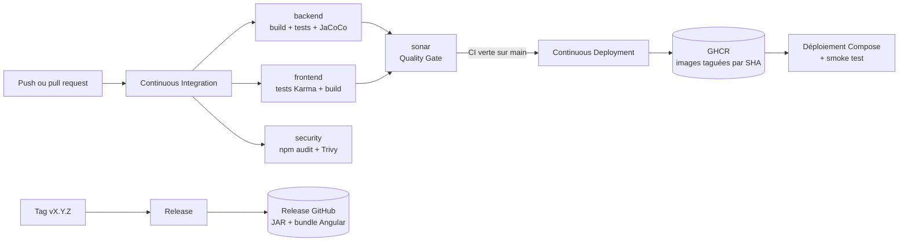

Trois workflows, trois déclencheurs distincts. **Aucune image ne peut être publiée sans avoir traversé toute la CI** : le déploiement n'est pas déclenché par un push, mais par la *réussite* de l'intégration. Publier depuis une branche de travail ou une pull request est donc techniquement impossible.

## 2. Étapes de mise en œuvre du pipeline CI/CD

### 2.1 Structure du pipeline

#### Workflow d'intégration continue

Le workflow [`ci.yml`](.github/workflows/ci.yml) est déclenché sur chaque push, sur les pull requests vers `main`, chaque nuit à 02:30 UTC et manuellement depuis l'onglet **Actions**.

| Ordre | Job | Contenu | Artefacts conservés |
| --- | --- | --- | --- |
| 1 (parallèle) | `backend` | Java 17, `./gradlew build collectSonarLibraries` | Rapports de tests, couverture JaCoCo, classes de production et de test, jars du classpath |
| 1 (parallèle) | `frontend` | Node.js 20 + Chrome, `npm ci`, tests Karma `ChromeHeadlessNoSandbox` avec couverture, `npm run build` | Couverture LCOV, dossier `dist` |
| 1 (parallèle) | `security` | `npm audit`, résolution des dépendances Gradle, Trivy sur le dépôt | — |
| 2 | `sonar` | Dépend de `backend` et `frontend` : récupère les classes Java, le classpath et la couverture frontend, puis soumet l'analyse | — |

Les trois premiers jobs tournent **en parallèle** ; `sonar` attend les deux builds, dont il consomme les artefacts. D'où une durée médiane de 2 min 14 s alors que la somme des jobs dépasse 4 minutes.

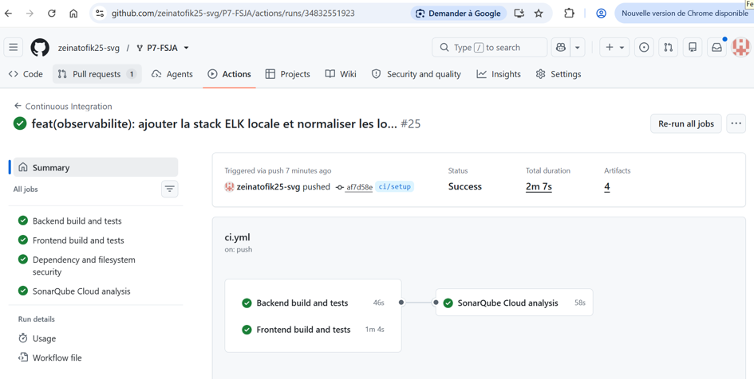

*Figure 1 — Exécution `#25` de la CI sur le commit `af7d58e`, terminée en 2 min 07 s avec 4 artefacts. `Backend build and tests` (46 s), `Frontend build and tests` (1 min 04 s) et `Dependency and filesystem security` s'exécutent en parallèle ; `SonarQube Cloud analysis` (58 s) attend leurs artefacts.*

#### Déploiement continu

[`cd.yml`](.github/workflows/cd.yml) se déclenche sur l'événement `workflow_run`, à la fin de la CI. Il ne publie qu'à quatre conditions réunies : CI réussie, événement `push`, branche `main`, dépôt d'origine correct.

Il récupère alors le SHA exact validé par la CI, s'authentifie à GHCR avec le `GITHUB_TOKEN`, construit les étapes `front` et `back` avec Buildx, puis publie les deux images sous un tag SHA immuable et le tag de confort `main`.

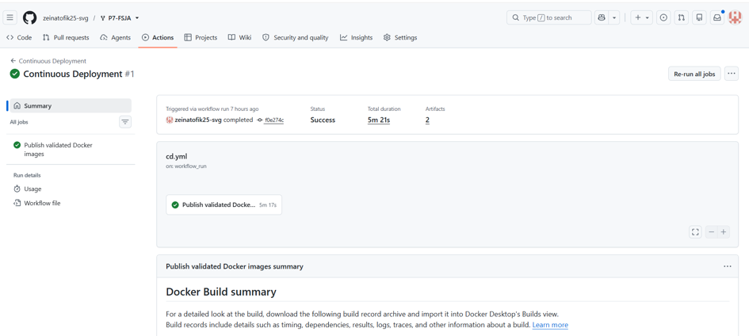

*Figure 2 — Première exécution du CD, déclenchée par `workflow_run` sur le commit de fusion `f0e274c`. Durée totale 5 min 21 s, dont 5 min 17 s pour le job unique `Publish validated Docker images`.*

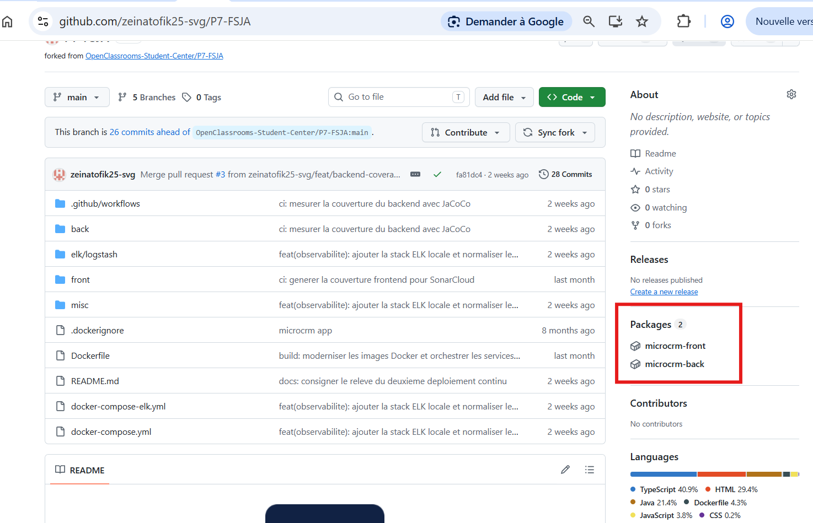

*Figure 3 — Les deux paquets `microcrm-front` et `microcrm-back` publiés dans GHCR, visibles depuis la page d'accueil du dépôt. Chaque image porte un tag SHA immuable, vérifiable depuis l'onglet **Packages**.*

#### Releases et versioning

[`release.yml`](.github/workflows/release.yml) se déclenche sur un tag `vX.Y.Z`. Il valide le format SemVer, construit le backend avec `-PappVersion=<version>` et le frontend, **démarre réellement le JAR produit** et interroge `/persons` jusqu'à réponse, puis publie la release avec le JAR et l'archive `microcrm-front-<version>.zip`. Un tag suffixé comme `v0.1.0-rc.1` devient automatiquement une pré-release.

Le projet suit [SemVer](https://semver.org/lang/fr/) : **MAJOR** pour une rupture de l'API REST, **MINOR** pour un ajout rétrocompatible, **PATCH** pour une correction. Trois décisions encadrent cette politique :

- **Pas de release par commit.** Chaque commit sur `main` produit déjà une image taguée par SHA, testée et analysée : c'est le livrable de l'intégration continue. Une release par commit n'ajouterait rien et rendrait l'historique illisible.
- **La release est une décision humaine.** L'équipe choisit le contenu et le numéro, pousse un tag annoté ; le reste est automatisé. Un simple merge ne doit pas incrémenter une version publique.
- **Pas de branche par release.** Trunk-based : `main` est la seule branche durable, les versions sont des tags immuables. Une branche `hotfix/X.Y.Z` n'est créée depuis un tag qu'en cas de correctif urgent alors que `main` a déjà avancé.

#### Pourquoi ces actions GitHub

| Action | Rôle | Justification |
| --- | --- | --- |
| `actions/checkout` | Récupération du code | Le job `sonar` utilise `fetch-depth: 0`, nécessaire à SonarQube pour attribuer les lignes du nouveau code |
| `actions/setup-java` | JDK Temurin 17 | Version imposée par `sourceCompatibility` ; le cache Gradle est activé |
| `actions/setup-node` | Node.js 20 | Requis par Angular 17 ; cache npm indexé sur `front/package-lock.json` |
| `browser-actions/setup-chrome` | Chrome headless | Karma exige un navigateur réel ; évite d'installer Chrome à la main dans le runner |
| `aquasecurity/trivy-action` | Scan secrets et vulnérabilités | Un seul outil couvre la recherche de secrets et le scan du système de fichiers |
| `SonarSource/sonarqube-scan-action` | Analyse qualité | Scanner officiel ; le Quality Gate est posté par l'application SonarCloud comme check GitHub |
| `docker/build-push-action` + `setup-buildx-action` | Construction et publication | Cache `type=gha` : le CD est passé de 5 min 21 s à 1 min 42 s entre la première et la deuxième publication |
| `actions/upload-artifact` / `download-artifact` | Transfert entre jobs | Évite de recompiler le backend dans le job `sonar` |

**Toutes les actions sont épinglées par SHA de commit**, jamais par tag. Un tag Git est mutable : qui compromet une action peut repositionner `@v4` sur du code malveillant, qui s'exécuterait avec les permissions du workflow. L'épinglage par SHA rend cette substitution impossible.

### 2.2 Scripts d'automatisation

| Script ou tâche | Emplacement | Rôle | Exécution |
| --- | --- | --- | --- |
| `collectSonarLibraries` | [back/build.gradle](back/build.gradle) | Copie les jars du `testRuntimeClasspath` dans `back/build/sonar-libraries` pour que SonarQube résolve les types Java | `./gradlew collectSonarLibraries`, appelée par la CI |
| `jacocoTestReport` | [back/build.gradle](back/build.gradle) | Produit le rapport XML de couverture Java, seul format accepté par SonarQube | Automatique, `finalizedBy` la tâche `test` |
| `restore.sh` | [misc/scripts/restore.sh](misc/scripts/restore.sh) | Redéploie une version publiée et vérifie qu'elle répond | `./misc/scripts/restore.sh <sha>` |

La tâche `collectSonarLibraries` corrige un défaut constaté à la première analyse : SonarCloud signalait **trois avertissements**, deux sur l'absence du classpath Java, un sur l'encodage de fichiers source. Sans classpath, l'analyseur ne résout pas les types issus des dépendances et **dégrade silencieusement sa détection** : les règles liées à Spring, à JPA ou aux API tierces ne s'appliquent tout simplement pas. Après correction, le langage `java` est apparu dans le périmètre avec 226 lignes et 5 issues — contre zéro auparavant.

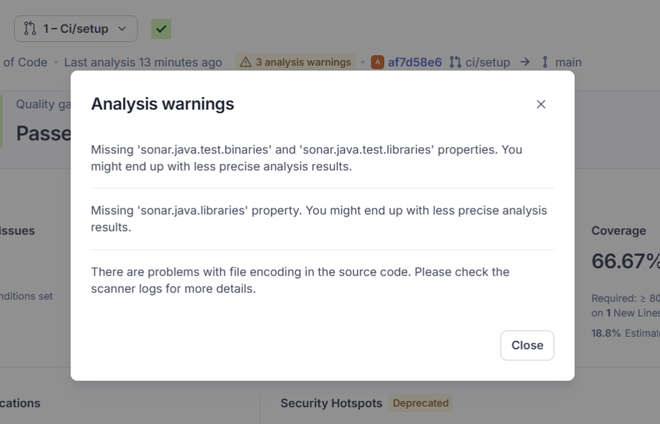

*Figure 4 — Les trois avertissements sur la pull request `#1`, commit `af7d58e6`. Le Quality Gate est pourtant `Passed` : **un avertissement ne fait jamais échouer une analyse**, il en réduit silencieusement la portée.*

L'effet de la correction se lit directement sur la couverture.

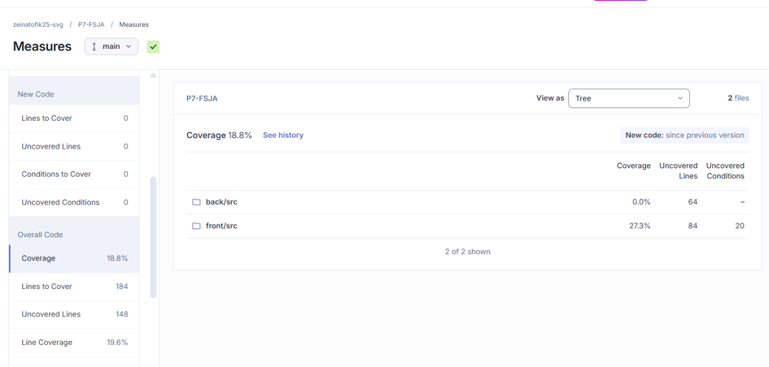

*Figure 5 — **Avant.** Couverture globale 18,8 % : `back/src` à **0,0 %** avec 64 lignes non couvertes, faute de rapport JaCoCo. `front/src` atteint déjà 27,3 % grâce au LCOV.*

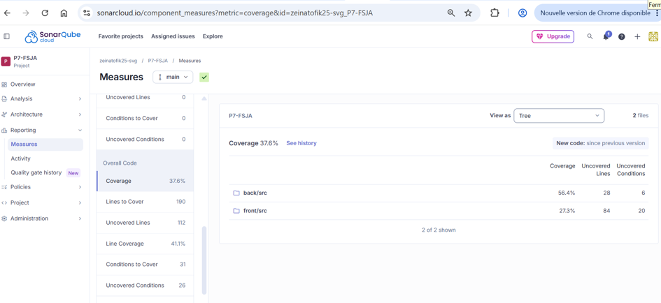

*Figure 6 — **Après.** Couverture globale 37,6 %, `back/src` à **56,4 %**, sans qu'aucun test n'ait été ajouté. Seule la chaîne de mesure a été corrigée.*

Pour un autre registre, surcharger `GHCR_OWNER` ; pour un démarrage plus lent, `HEALTH_TIMEOUT` (300 s par défaut).

### 2.3 Reproductibilité

#### Relancer le pipeline

| Besoin | Action |
| --- | --- |
| Rejouer une exécution à l'identique | Onglet **Actions** → exécution → **Re-run all jobs** |
| Relancer uniquement les jobs en échec | **Re-run failed jobs** |
| Déclencher hors de tout commit | **Run workflow** (`workflow_dispatch`) |
| Reproduire en local | `cd back && ./gradlew build` puis `cd front && npm ci && npm test -- --watch=false --browsers=ChromeHeadlessNoSandbox` |

La reproductibilité tient à trois choix : versions d'outils explicites, installation depuis les fichiers verrouillés (`npm ci` et Gradle Wrapper, jamais `npm install`), actions épinglées par SHA. La CI, le poste de développement et l'image publiée résolvent ainsi les mêmes versions.

#### Gestion des secrets

| Élément | Type | Stockage |
| --- | --- | --- |
| `SONAR_TOKEN` | Secret | **Settings > Secrets and variables > Actions**, permissions minimales d'analyse |
| `SONAR_PROJECT_KEY` | Variable | Clé du projet SonarQube, non sensible |
| `SONAR_ORGANIZATION` | Variable | Identifiant de l'organisation SonarQube, non sensible |
| `GITHUB_TOKEN` | Secret automatique | Fourni par GitHub Actions, jamais créé ni stocké manuellement |

Aucun secret n'apparaît dans le dépôt, les Dockerfiles ou les journaux. Les permissions sont réduites au minimum : `contents: read` par défaut, `packages: write` sur le seul job de publication, `contents: write` sur le seul workflow de release. Trivy exécute une recherche de secrets **bloquante** à chaque CI : un identifiant commité par inadvertance fait échouer la chaîne.

Les secrets ne sont pas exposés aux pull requests venant d'un fork. Le job `sonar` détecte ce cas et émet un avertissement au lieu d'échouer ; build et sécurité restent exécutables.

## 3. Plan de conteneurisation et de déploiement

### 3.1 Dockerfiles

Le [`Dockerfile`](Dockerfile) racine est un build multi-étapes produisant quatre cibles.

| Étape | Image de base | Rôle |
| --- | --- | --- |
| `front-build` | `node:20-alpine` | Compile le bundle Angular |
| `back-build` | Eclipse Temurin JDK 17 | Compile le JAR Spring Boot |
| `front` | Caddy 2 Alpine | Sert les fichiers statiques et relaie `/api` vers le backend |
| `back` | Eclipse Temurin JRE 17 Jammy | Exécute le JAR |
| `standalone` | — | Réunit les deux processus via Supervisor |

**Le multi-stage est ce qui permet de ne livrer aucun outil de compilation.** Les étapes de build contiennent le JDK, Gradle, Node.js et tout `node_modules` ; les images finales ne reçoivent que les artefacts compilés. C'est la différence entre 70 Mo pour le frontend et les centaines de mégaoctets qu'aurait coûté une image mono-étape.

Les autres choix :

- **JRE et non JDK** pour le backend : le compilateur n'a rien à faire à l'exécution.
- **Utilisateur non privilégié** pour le backend : une compromission du processus ne donne pas root dans le conteneur.
- **Aucune donnée persistante** dans les images, la configuration venant des variables d'environnement.
- **Contexte limité** par `.dockerignore` : build plus rapide, pas de fichier local copié par accident.
- **Versions de base explicites**, jamais `latest`, pour que deux constructions du même commit donnent le même résultat.

L'étape `standalone` reste disponible pour la démonstration, mais **n'est pas la cible de production** : deux processus sous un superviseur dans un même conteneur empêchent de dimensionner, redémarrer ou surveiller les services séparément.

Tailles mesurées après `docker pull` du tag `fa81dc4` : **frontend 70 Mo**, **backend 558 Mo**.

### 3.2 docker-compose.yml

[`docker-compose.yml`](docker-compose.yml) décrit l'exécution locale et l'environnement de validation.

| Service | Image | Ports | Contrôle de santé |
| --- | --- | --- | --- |
| `back` | `orion-microcrm-back:local` (étape `back`) | `8080:8080` | `wget --spider http://127.0.0.1:8080/persons`, toutes les 10 s, 12 tentatives, `start_period` 20 s |
| `front` | `orion-microcrm-front:local` (étape `front`) | `80:80` | `wget --spider http://127.0.0.1/health`, toutes les 10 s, 3 tentatives |

Le service `front` déclare `depends_on: back: condition: service_healthy` : Compose ne démarre Caddy qu'une fois le backend réellement prêt, et non simplement démarré. Les deux services routent leurs journaux vers Logstash via le driver `gelf`, avec un `tag` identifiant le service. Aucune base n'est déclarée : HSQLDB est embarquée en mémoire dans le backend.

**Lancement local depuis les sources :**

```shell
docker compose config
docker compose up --build -d
docker compose ps
```

Le frontend répond sur http://localhost, l'API sur http://localhost:8080. Dans l'interface, les appels passent par `/api` et Caddy les relaie sur le réseau interne. Le statut `healthy` des deux services confirme le démarrage. Pour arrêter : `docker compose down`.

Compose reproduit fidèlement le déploiement et permet le smoke test, mais **ne remplace pas un orchestrateur** dès que la haute disponibilité est requise.

### 3.3 Déploiement des images publiées

#### Prérequis techniques

| Prérequis | Valeur | Vérification |
| --- | --- | --- |
| Docker Engine avec Compose v2 | Testé avec Docker Desktop 4.87, Engine 29.7.2 | `docker compose version` |
| Accès en lecture à GHCR | Compte disposant du droit `read:packages` | `docker login ghcr.io` |
| Ports libres sur l'hôte | `80` pour le frontend, `8080` pour l'API | `docker compose config` |
| Mémoire disponible | 2 Go pour l'application seule, 6 Go si la pile ELK tourne sur la même machine | `docker info` |
| SHA validé à déployer | Tag d'image produit par un workflow CD réussi | Onglet **Actions**, workflow `Continuous Deployment` |

Aucun secret n'est nécessaire au déploiement : l'application ne lit aucune variable sensible et la base est embarquée.

#### Ordre de déploiement

L'ordre est imposé par deux dépendances techniques et ne peut pas être inversé :

1. **La pile ELK d'abord**, si le monitoring est souhaité : `gelf` émet en UDP sans accusé de réception, donc tout conteneur démarré avant Logstash perd définitivement ses journaux.
2. **Le backend ensuite**, car le frontend attend son contrôle de santé.
3. **Le frontend enfin**, qui expose le port 80 et relaie `/api`.

#### Procédure

```shell
docker login ghcr.io
docker pull ghcr.io/<organisation-ou-utilisateur>/microcrm-front:<sha>
docker pull ghcr.io/<organisation-ou-utilisateur>/microcrm-back:<sha>

docker tag ghcr.io/<organisation-ou-utilisateur>/microcrm-front:<sha> orion-microcrm-front:local
docker tag ghcr.io/<organisation-ou-utilisateur>/microcrm-back:<sha> orion-microcrm-back:local

docker compose up -d --no-build --force-recreate
docker compose ps
```

L'option `--no-build` est essentielle : elle garantit que l'artefact déployé est bien l'image testée par la CI, et non une recompilation locale susceptible de diverger. Le déploiement est terminé quand les deux services affichent `healthy` — **75,6 secondes** lors du relevé du 14 septembre 2026.

#### Vérification

```shell
curl -f http://localhost/health
curl -f http://localhost/api/persons
curl -f http://localhost:8080/persons
```

Les trois réponses doivent être en succès. Contrôler ensuite Kibana pendant 15 minutes avec `log_level: "ERROR"` : au-delà de 1 % d'erreurs, revenir en arrière. Avant promotion, les images peuvent être scannées avec `docker scout cves`.

#### Risques de mise en production

Ces risques proviennent d'incidents réellement rencontrés pendant la mise en place du pipeline, classés par gravité opérationnelle.

| # | Risque | Déclencheur observé ou plausible | Détection | Parade |
| --- | --- | --- | --- | --- |
| R1 | **Perte totale des données applicatives** à chaque redéploiement | HSQLDB est en mémoire ; tout contenu saisi disparaît à l'arrêt du conteneur | Aucune : la perte est silencieuse et le jeu de fixtures masque le vide | Interdire toute exploitation avec données réelles tant qu'une base persistante externe n'est pas en place |
| R2 | **Exposition publique de l'API sans authentification** | Les repositories Spring Data REST exposent lecture et écriture, et CORS autorise l'origine `*` | Aucune en l'état | Restreindre CORS et protéger les routes avant toute exposition hors poste local |
| R3 | **Le frontend ne démarre jamais** parce que le backend n'atteint pas `healthy` | Démarrage backend mesuré entre 41 et 102 s pour un budget de healthcheck de 140 s ; sur une machine plus lente le seuil est franchi | `docker compose ps` reste bloqué sur `health: starting` | Porter `start_period` à 60 s, et revérifier après toute montée de version de Spring Boot |
| R4 | **Déploiement non reproductible** | Utilisation du tag `main`, qui est mutable | Aucune : deux déploiements du même tag peuvent différer | N'utiliser que le tag SHA ; le tag `main` reste un confort de lecture |
| R5 | **Publication d'une image qui ne démarre pas** | Le workflow CD publie sans jamais démarrer les images ; seul `release.yml` vérifie le démarrage du JAR | Découverte au déploiement | Exécuter [`misc/scripts/restore.sh`](misc/scripts/restore.sh) sur le SHA publié avant toute promotion |
| R6 | **Perte silencieuse des journaux, donc de la capacité de détection** | Le driver `gelf` émet en UDP sans accusé de réception ; tout conteneur démarré avant Logstash perd ses journaux | Absence de documents récents dans `microcrm-logs-*` | Respecter l'ordre de démarrage, et contrôler `_count` après chaque déploiement |
| R7 | **Destruction accidentelle de l'autre pile** | Les deux fichiers Compose partagent le projet `p7-fsja` ; `docker compose down --remove-orphans` supprime les conteneurs de l'autre fichier | Avertissement `Found orphan containers` à chaque commande | Ne jamais employer `--remove-orphans`, ou isoler la pile ELK sous un nom de projet distinct |
| R8 | **Indisponibilité de GHCR bloquant déploiement et restauration** | La procédure de déploiement comme le script de restauration dépendent du registre | Échec du `docker pull` | Conserver localement les images des deux derniers SHA validés |

R1 et R2 sont bloquants : ils interdisent toute mise en production avec des données réelles ou une exposition publique. Constat assumé pour une application de démonstration, à lever avant tout autre usage.

#### Retour arrière et promotion

Le rollback consiste à rejouer le déploiement avec le SHA précédent, ce qu'automatise [`misc/scripts/restore.sh`](misc/scripts/restore.sh) (section 7.3). Sans migration de données, l'opération est symétrique.

Un push sur `main` qui passe tests, scans et Quality Gate publie les images. Un environnement de recette déploie ces mêmes artefacts et exécute les contrôles ci-dessus ; la promotion réutilise l'image déjà validée, **sans recompilation**. La production est protégée par un environnement GitHub avec approbation manuelle, secrets séparés et journalisation.

## 4. Plan de testing périodique

### 4.1 Types de tests automatisés

- **Backend** : `./gradlew test` exécute les tests JUnit 5 et les tests d'intégration Spring Boot avec HSQLDB. Ils vérifient notamment le contexte applicatif, les repositories et les comportements REST couverts par le projet.
- **Frontend** : `npm test -- --watch=false --browsers=ChromeHeadlessNoSandbox` exécute les tests unitaires Jasmine via Karma dans Chrome headless. Ils vérifient les composants, services et parcours Angular couverts par les spécifications existantes.
- **Builds de validation** : `./gradlew build` et `npm run build` vérifient que le JAR et les fichiers statiques Angular sont produisibles avec les versions supportées.
- **Démarrage de l'artefact publié** : lors d'une release, le JAR construit est démarré et interrogé sur `/persons` jusqu'à obtenir une réponse, ce qui garantit qu'un livrable non exécutable ne peut pas être publié.
- **Validation intégration conteneurisée** : `docker compose config` puis `docker compose up --no-build` suivis des contrôles de santé et des appels à `/health`, `/api/persons` et `/api/organizations`. Cette validation est exécutée **manuellement** par l'opérateur avant une mise en production ou après une restauration ; elle n'est pas automatisée en CI, le coût d'un démarrage complet de la pile étant disproportionné par rapport au rythme actuel de livraison.

### 4.2 Fréquence d'exécution

| Moment | Contrôles | Déclencheur réel | Objectif |
| --- | --- | --- | --- |
| Chaque push sur une branche | Tests backend, tests frontend, builds, audit des dépendances et analyse SonarQube | `ci.yml`, `on: push` | Détecter immédiatement une régression introduite par le commit |
| Chaque pull request vers `main` | Même socle complet, avec décoration de la pull request par SonarQube Cloud | `ci.yml`, `on: pull_request` | Bloquer l'intégration d'un code non compilable, régressif ou ne respectant pas le niveau de qualité attendu |
| Chaque nuit à 02:30 UTC | Tests complets, audit `npm audit`, résolution des dépendances Gradle et scan Trivy du dépôt | `ci.yml`, `on: schedule` | Détecter une régression liée à une dépendance nouvellement signalée, même sans nouveau commit |
| À chaque tag `vX.Y.Z` | Build versionné puis démarrage réel du JAR et appel à `/persons` | `release.yml`, `on: push tags` | Garantir que l'artefact publié est exécutable |
| Avant une mise en production | Contrôle du Quality Gate, puis déploiement des images taguées par SHA et smoke test manuel sur l'environnement cible | Opérateur | Réduire le risque fonctionnel et opérationnel de la livraison |

Le rythme est aligné sur ce que les workflows exécutent réellement. **Un plan de testing qui annonce des contrôles inexistants donne une fausse assurance** : mieux vaut documenter une vérification manuelle assumée qu'une automatisation imaginaire.

Les rapports de tests et de couverture sont conservés comme artefacts. Une pull request ne peut être fusionnée que si tests, build et Quality Gate sont réussis. Un test instable se corrige ou s'isole : le relancer ne fait que masquer l'anomalie.

### 4.3 Objectifs des tests et critères de réussite

| Objectif | Ce qui le couvre | Critère de réussite | Seuil d'alerte |
| --- | --- | --- | --- |
| **Qualité** | Analyse SonarQube sur chaque push et chaque pull request | Quality Gate `OK` : 0 nouveau bug, 0 nouvelle vulnérabilité, 0 Security Hotspot non examiné, duplication du nouveau code inférieure à 3 % | Tout avertissement d'analyse, qui fausserait la comparaison entre livraisons |
| **Non-régression** | Tests JUnit 5 et Jasmine exécutés avant tout build | 100 % des tests passants ; un échec bloque la fusion | Test instable : à corriger ou isoler, jamais à relancer aveuglément |
| **Sécurité** | `npm audit`, Trivy secrets et vulnérabilités | 0 vulnérabilité critique sur une dépendance de production, 0 secret détecté | Vulnérabilité haute sur une dépendance de développement : rapportée, triée au sprint |
| **Bon fonctionnement avant déploiement** | Contrôles de santé Compose et smoke test sur `/health`, `/api/persons`, `/api/organizations` | Les deux services `healthy` et les trois appels en succès | Un service bloqué sur `health: starting` au-delà de 140 s |
| **Exécutabilité du livrable** | Démarrage réel du JAR dans `release.yml` | Réponse obtenue sur `/persons` en moins de 60 s | Absence de réponse : la release n'est pas publiée |

La couverture est suivie **par langage**, une moyenne globale masquant les déséquilibres : backend 56,4 %, frontend 27,3 %, pour une cible de 80 % sur le nouveau code.

## 5. Plan de sécurité

### 5.1 Résultats SonarQube

#### Périmètre

SonarQube Cloud analyse le backend Java et le frontend TypeScript, sur les pull requests et sur `main`. Le Quality Gate est un contrôle obligatoire avant fusion. Sont surveillés : vulnérabilités et Security Hotspots, bugs et duplications, code smells et complexité, couverture du nouveau code, dépendances obsolètes.

#### Relevé du 14 septembre 2026

Le Quality Gate exige : aucune nouvelle vulnérabilité ni bug bloquant, aucun Security Hotspot non examiné, 80 % de couverture et moins de 3 % de duplication sur le nouveau code.

| Relevé SonarQube | Valeur sur `main` au 14 septembre 2026 | Décision |
| --- | --- | --- |
| Quality Gate | **OK** | Échec : fusion bloquée |
| Vulnérabilités ouvertes | **4**, note de sécurité C | Toute criticité haute ou critique : correction prioritaire |
| Security Hotspots examinées | **100 %** (aucun hotspot détecté) | 100 % requis avant livraison |
| Bugs | **9**, note de fiabilité C | Bloquant/critique : correction avant fusion |
| Duplications nouveau code | **0 %** (2,5 % sur l'ensemble du code) | Supérieur à 3 % : justification ou refactoring ciblé |
| Complexité des méthodes prioritaires | Complexité cognitive **19**, cyclomatique **92** pour 973 lignes | Découpage et tests lorsque le seuil du profil est dépassé |
| Couverture Java | **56,4 %** (226 lignes) | Inférieure à 80 % : compléter les tests des cas d'erreur REST |
| Couverture TypeScript | **27,3 %** (735 lignes) | Inférieure à 80 % : ajouter les tests Jasmine/Karma |
| Avertissements d'analyse | **0** | Tout avertissement fausse la comparaison entre livraisons |

Ce relevé correspond à l'analyse du commit `fa81dc4`, exécutée le 14 septembre 2026 à 20:21:43 UTC. **Les notes C portent exclusivement sur du code hérité** : aucune des pull requests livrées n'a introduit de bug, de vulnérabilité ni de code smell.

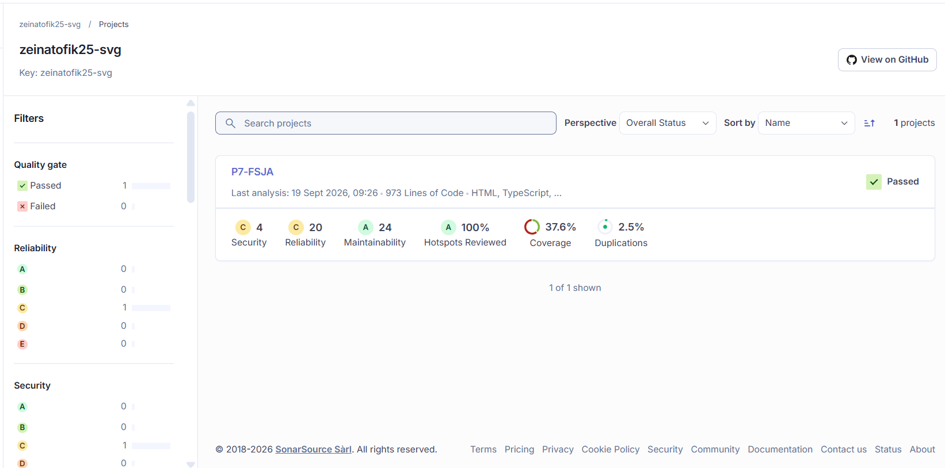

*Figure 7 — Vue d'ensemble du projet : Quality Gate **Passed**, 973 lignes de code, couverture 37,6 %, duplications 2,5 %, Security Hotspots examinés à 100 %. Les notes de sécurité et de fiabilité sont à **C**, la maintenabilité à **A**.*

> **Lecture des compteurs.** Les nombres affichés à côté des notes (Security 4, Reliability 20, Maintainability 24) relèvent de la taxonomie « qualités logicielles » de SonarCloud, où une même issue peut peser sur plusieurs qualités. Ils ne se superposent pas aux métriques historiques du tableau ci-dessus (9 bugs, 4 vulnérabilités, 30 code smells). Les deux lectures sont correctes ; seule leur comparaison serait fausse.


*Figure 8 — Couverture ventilée par répertoire : `back/src` à 56,4 % pour 28 lignes non couvertes, `front/src` à 27,3 % pour 84 lignes non couvertes. Le suivi par langage est indispensable, la moyenne globale de 37,6 % masquant un écart de plus de 29 points entre les deux composants.*

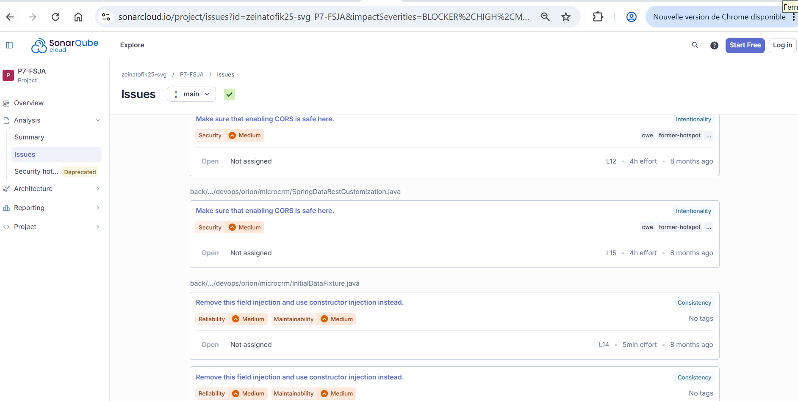

*Figure 9 — Issues Java sur `main`, invisibles avant la correction du classpath : deux alertes `Make sure that enabling CORS is safe here` sur `SpringDataRestCustomization.java` (4 h d'effort chacune) et des injections de champ signalées sur `InitialDataFixture.java`. Les alertes CORS confirment par l'outil le risque **R2** identifié manuellement.*

### 5.2 Analyse des risques

#### Constats prioritaires

Les éléments **constatés** ont été vérifiés dans le code, les éléments **mesurés** proviennent de l'analyse du commit `fa81dc4`. Le traitement de chacun figure en 5.3.

| Priorité | Domaine | Constat | Risque |
| --- | --- | --- | --- |
| P1 | Exposition API | **Constaté** : les repositories Spring Data REST exposent lecture et écriture, sans authentification applicative | Consultation ou modification non autorisée de données personnelles |
| P1 | CORS | **Constaté** : l'origine `*` est autorisée sur toutes les routes | Une application tierce peut appeler l'API depuis le navigateur d'un utilisateur |
| P1 | Données personnelles | **Constaté** : `Person` contient e-mail, téléphone et biographie | Exposition par l'API ou par les journaux |
| P1 | Vulnérabilités | **Mesuré** : 4 vulnérabilités, 0 Security Hotspot, note de sécurité C | Exploitation d'une faiblesse identifiée |
| P2 | Validation des entrées | **Constaté** : aucun DTO ni annotation de validation sur `Person` | Données invalides, volumétrie non maîtrisée |
| P2 | Couverture | **Mesuré** : backend 56,4 %, frontend 27,3 %, dont 26,7 % sur `person-details` | Cas d'erreur REST et composants non protégés |
| P2 | Fiabilité | **Mesuré** : 9 bugs, 30 code smells, 104 minutes de dette | Erreurs de production, coût de maintenance |
| P3 | Maintenabilité | **Mesuré** : duplication 2,5 % globale et 0 % sur le nouveau code, complexité cognitive 19 | Lisibilité réduite, refactoring risqué |

Les P1 sont des risques de sécurité ou de confidentialité et **ne doivent pas être assimilés aux code smells P3**. Duplication et complexité relèvent de la maintenabilité ; elles ne deviennent des risques de fiabilité que lorsqu'elles empêchent de tester ou de corriger avec confiance.

#### Croisement SonarQube, CI et journaux applicatifs

Après chaque livraison, surveiller Kibana 15 minutes avec `service_name: "microcrm-back" and log_level: "ERROR"` et comparer au taux précédant le déploiement. Une alerte SonarQube de fiabilité devient prioritaire si elle correspond à une hausse de ces erreurs. Inversement, une erreur répétée dans ELK doit produire un test de régression, puis renvoyer aux règles SonarQube de la zone concernée. **Aucun e-mail, téléphone, biographie ou jeton ne doit apparaître dans les journaux** : une telle occurrence est un incident de sécurité immédiat.

#### Règles de sécurité appliquées par la CI

- Le token `SONAR_TOKEN`, les identifiants du registre et toute configuration sensible sont stockés dans les secrets GitHub ou dans les variables d'environnement de l'environnement de déploiement. Ils ne sont jamais écrits dans le dépôt, les Dockerfiles ou les journaux.
- Les dépendances sont installées à partir des fichiers verrouillés (`npm ci` et Gradle Wrapper). La chaîne échoue en cas de vulnérabilité **critique sur une dépendance de production** (`npm audit --omit=dev --audit-level=critical`) ou de **secret détecté** dans le dépôt. L'audit complet, incluant les dépendances de développement, et le scan de vulnérabilités du système de fichiers sont exécutés en mode rapport : ils n'interrompent pas la chaîne mais doivent être triés à chaque sprint. Ce seuil différencié est un choix assumé : les outils de build Angular actuels portent des vulnérabilités connues qui ne sont pas livrées en production et dont la correction impose une montée de version majeure, planifiée séparément.
- Les actions GitHub et les images de base sont maintenues à jour et référencées par un SHA explicite. Les permissions du workflow sont limitées au principe du moindre privilège et les publications sont interdites depuis une pull request.
- Les images sont construites en plusieurs étapes, ne contiennent ni outils de build ni secrets, et exécutent les services avec un utilisateur non privilégié lorsque les images utilisées le permettent.
- Les entrées reçues par l'API sont validées, les erreurs ne révèlent pas de détails internes et les journaux ne contiennent pas de données personnelles. Les règles OWASP applicables aux API REST et aux applications web Angular sont vérifiées lors de chaque revue.

Les alertes SonarQube, Dependabot et les scans de dépendances sont triés à chaque sprint. Une vulnérabilité critique fait l'objet d'un traitement prioritaire et peut déclencher une mise en pause des publications.

### 5.3 Plan d'action et remédiation

#### Actions immédiates, avant toute exposition hors du poste local

| Action | Risque couvert | État |
| --- | --- | --- |
| Restreindre CORS aux origines attendues par environnement | R2, P1 CORS | À faire |
| Protéger les routes REST par authentification et autorisation par rôle | R2, P1 Exposition API | À faire |
| Vérifier que les réponses de l'API ne retournent que les champs nécessaires | P1 Données personnelles | À faire |
| Fournir le classpath Java à SonarQube pour supprimer les angles morts d'analyse | A5 | **Fait** le 14 septembre 2026 |
| Activer les journaux d'accès HTTP de Caddy | A4 | **Fait** le 14 septembre 2026 |

#### Actions à court terme, sur les deux prochains sprints

| Action | Risque couvert | État |
| --- | --- | --- |
| Introduire des DTO et les contraintes `@NotBlank`, `@Email` et longueurs maximales, avec les tests 400 associés | P2 Validation des entrées | À faire |
| Configurer JaCoCo et transmettre le rapport XML à SonarQube | P2 Couverture backend | **Fait** le 14 septembre 2026 |
| Compléter les tests backend sur les cas d'erreur REST pour atteindre 80 % | P2 Couverture backend | À faire, 56,4 % actuellement |
| Compléter les tests frontend, en priorité `person-details` | P2 Couverture frontend | À faire, 27,3 % actuellement |
| Porter `start_period` du healthcheck backend à 60 s | R3 | À faire |
| Traiter les 9 bugs et 4 vulnérabilités du code hérité | P1 Vulnérabilités, P2 Fiabilité | À faire |

#### Actions à long terme

| Action | Risque couvert | Condition de déclenchement |
| --- | --- | --- |
| Migrer vers une base de données persistante externe | R1 | Prérequis à toute exploitation avec données réelles ; rend caduc le plan de sauvegarde actuel |
| Monter Angular en version majeure pour éliminer les vulnérabilités de la chaîne de build | Règle d'audit différenciée | Permettra de resserrer le seuil `npm audit` sur les dépendances de développement |
| Réduire l'image backend sous 400 Mo | Coût de transfert au déploiement | 558 Mo actuellement, contre 70 Mo pour le frontend |
| Isoler la pile ELK sous un nom de projet Compose distinct | R7 | Supprime définitivement le risque de `--remove-orphans` |

Chaque élément P1 est un risque de sécurité ou de confidentialité et ne doit pas être assimilé à un code smell P3. Un ticket n'est fermé qu'après validation par la CI **et** absence de récidive dans les journaux applicatifs.

## 6. Monitoring, métriques & KPI

### 6.0 Mise en place du monitoring

#### Architecture

Le monitoring vit dans un fichier séparé, [`docker-compose-elk.yml`](docker-compose-elk.yml), pour ne pas alourdir la CI/CD ni le démarrage standard : Elasticsearch, Logstash et Kibana 8.15.3. Pile destinée au poste de développement, authentification Elastic désactivée, 1 Go de heap pour Elasticsearch et 512 Mo pour Logstash. Prévoir 4 Go de RAM pour Docker Desktop.

**Aucun agent ni bibliothèque d'observabilité dans les conteneurs applicatifs.** Les services écrivent sur leur sortie standard et le driver Docker `gelf` transmet ces flux à Logstash en UDP sur le port `12201`. Le code applicatif ne gagne aucune dépendance et le monitoring reste entièrement optionnel : sans la pile ELK, l'application fonctionne à l'identique.

| Source | Format | Contenu utile |
| --- | --- | --- |
| Backend Spring Boot | JSON Logback via `LogstashEncoder`, champ `service` à `microcrm-back` | Cycle de vie, exceptions, `application_log.stack_trace` |
| Frontend Caddy | JSON, journal d'accès activé dans le bloc de site | `application_log.status`, `request.uri`, `duration` |

Logstash décode le JSON quand il le peut, conserve le message brut sinon, puis indexe dans `microcrm-logs-AAAA.MM.JJ`.

#### Normalisation

Deux champs sont normalisés par [`elk/logstash/pipeline/logstash.conf`](elk/logstash/pipeline/logstash.conf), sans quoi les agrégations deviennent inexploitables :

- **`service_name`** vaut `microcrm-back` ou `microcrm-front`, repris du champ `service` du JSON et, à défaut, du `tag` du driver `gelf`. Sans ce repli, les lignes non JSON du backend partent sous le nom du conteneur Docker et coupent un même service en deux séries.
- **`log_level`** est mis en majuscules. Logback émet `INFO`/`WARN`/`ERROR`, Caddy `info`/`warn`/`error` : sans normalisation, chaque niveau compte double dans une agrégation sur `log_level.keyword`. Les lignes non JSON reçoivent le niveau déduit de la sévérité syslog.

Ces deux normalisations corrigent des anomalies réelles, détaillées en 6.3.

#### Démarrage, tableau de bord et diagnostic

L'ordre compte : `gelf` émet en UDP sans accusé de réception, donc tout conteneur démarré avant Logstash perd ses journaux.

```shell
docker compose -f docker-compose-elk.yml up --build -d
docker compose -f docker-compose-elk.yml ps
docker compose up --build -d
curl http://localhost:9200/microcrm-logs-*/_count
```

Kibana est sur http://localhost:5601, Elasticsearch sur http://localhost:9200. Pour arrêter en conservant les index : `docker compose -f docker-compose-elk.yml down` ; ajouter `-v` uniquement pour repartir à vide.

Dans **Stack Management > Data Views**, créer `microcrm-logs-*` avec `@timestamp` comme champ temporel, puis le tableau de bord `MicroCRM - Santé applicative` avec trois visualisations Lens :

| Visualisation | Configuration | Indicateur suivi |
| --- | --- | --- |
| Volume des événements | Barres, `Count` sur `@timestamp` | Activité et pics de charge |
| Erreurs par service | Barres, filtre `log_level: "ERROR"`, ventilation `service_name.keyword` | Services en erreur et volumétrie |
| Répartition des niveaux | Donut, `Count` découpé par `log_level.keyword` | Tendance INFO / WARN / ERROR |

`.keyword` est indispensable sur les ventilations : le champ analysé ne permet pas d'agréger par terme exact.

Si rien n'apparaît, vérifier dans l'ordre que Logstash écoute, que les conteneurs applicatifs ont été recréés après le démarrage d'ELK (`docker compose up -d --force-recreate`), et que Docker Desktop joint `host.docker.internal`. Le monitoring est volontairement exclu de la CI/CD : coût mémoire élevé, aucun besoin de rétention longue durée.

### 6.1 Métriques DORA

Les DORA mesurent séparément la vitesse de livraison et la fiabilité. Sources : historique GitHub Actions pour la chaîne, index `microcrm-logs-*` pour l'applicatif. **Aucune valeur n'est estimée** : elles proviennent de quatre déploiements réellement exécutés sur `main` entre le 14 et le 26 septembre 2026, et d'un incident provoqué volontairement.

#### Valeurs mesurées

| Métrique DORA | Méthode de calcul | Source | Valeur mesurée | Cible après 3 sprints |
| --- | --- | --- | --- | --- |
| Lead Time for Changes | Médiane entre la date d'auteur du commit livré et la fin du CD associé au même SHA | `git log` et `actions/runs/<id>/timing` | **16 min 29 s** (54:30 / 13:05 / 16:05 / 16:53) | Moins de 1 jour ouvré |
| Deployment Frequency | Déploiements CD réussis sur `main` / période observée | Workflows `Continuous Deployment` réussis | **4 en 13 jours**, soit environ 2 par semaine | Au moins 1 par semaine |
| Mean Time to Restore | Écart entre le début de l'incident horodaté et la première requête à nouveau servie | Horodatage de l'arrêt, Kibana, journaux du conteneur | **2 min 02 s** (1 incident simulé) | Moins de 4 heures |
| Change Failure Rate | (Déploiements ayant causé incident, rollback ou hotfix / total) × 100 | Workflows CD et journal d'incidents | **0 %** (0 sur 4) | Inférieur à 15 % |

Le Lead Time du premier déploiement (54 min 30 s) inclut l'attente de revue ; les trois suivants tombent entre 13 et 17 minutes. **La médiane est préférée à la moyenne** pour que cette attente ponctuelle ne masque pas la performance réelle de la chaîne, dont la part incompressible est de 4 à 5 minutes.

Le MTTR provient d'un incident **simulé** : arrêt volontaire du backend, détection par les journaux, redémarrage. Il mesure la capacité de détection et de restauration, pas la résolution d'une panne dont la cause serait inconnue. À ce titre il ne compte pas comme un échec de changement : le Change Failure Rate reste à 0 %, aucun déploiement n'ayant provoqué de régression.

Un déploiement ne compte qu'une fois dans le taux d'échec, même s'il produit plusieurs erreurs. Un échec de CI avant déploiement reste un signal de qualité mais **n'est pas** un échec de changement DORA. De même, une erreur isolée dans Kibana n'est un incident que si elle dégrade le service ou exige une intervention.

#### Chronologie de l'incident simulé

| Jalon | Horodatage UTC | Écart depuis T1 |
| --- | --- | --- |
| T1 — arrêt du backend (`docker compose stop back`) | 21:07:22,554 | — |
| T2 — détection : premier document `log_level: ERROR` avec `application_log.status: 502` | 21:07:27,695 | 5,1 s |
| Redémarrage du conteneur | 21:08:31,122 | 68,6 s |
| T3 — première requête à nouveau servie | 21:09:24,212 | **121,7 s** |

La détection en 5 secondes est le bénéfice direct des journaux d'accès Caddy : l'échec du `reverse_proxy` produit immédiatement un événement `ERROR`. **97 % du MTTR est en revanche consommé par le redémarrage applicatif**, le backend mettant 41 secondes à répondre après le lancement de la JVM. Réduire ce MTTR passe donc par l'accélération du démarrage, pas par l'amélioration de la supervision.

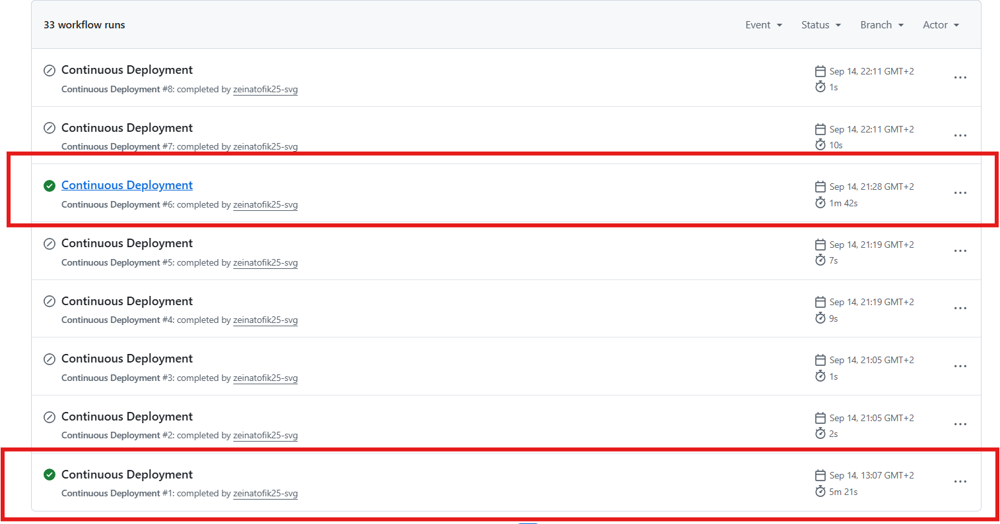

*Figure 10 — Historique du CD. Les deux exécutions encadrées sont les déploiements réussis n° 1 (**5 min 21 s**) et n° 2 (**1 min 42 s**) : l'écart de 68 % provient du cache Buildx, la première publication payant la construction complète des deux images. Les exécutions grisées de 1 à 10 secondes sont des déclenchements **ignorés**, le workflow vérifiant que la CI provient bien d'un push sur `main` avant de publier.*

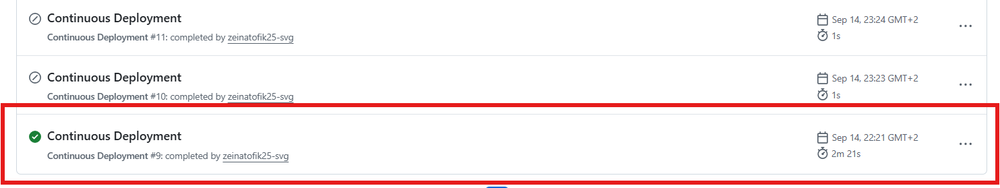

*Figure 11 — Troisième déploiement réussi, **2 min 21 s**, commit `fa81dc4`. Les quatre durées CD relevées sont 5 min 21 s, 1 min 42 s, 2 min 21 s puis 3 min 44 s.*

### 6.2 KPI personnalisés

| KPI | Méthode de calcul | Source | Valeur mesurée | Cible opérationnelle | Action si seuil dépassé |
| --- | --- | --- | --- | --- | --- |
| Durée CI | Médiane de la durée totale des workflows `Continuous Integration` réussis sur `main` | GitHub Actions | **2 min 14 s** (2:26 / 2:11 / 2:17 / 1:58) | Moins de 15 min | Identifier l'étape lente et exploiter le cache Gradle/npm |
| Taux de réussite CI | (Workflows CI réussis / workflows CI terminés) × 100 | GitHub Actions | **100 %** sur les 4 livraisons ; 42 % sur l'historique complet | Au moins 95 % | Corriger ou isoler le test instable avant nouveau merge |
| Durée des tests | Durée des étapes `Build and test` et `Run unit tests with coverage` | Journaux GitHub Actions | Backend **36 à 41 s**, frontend **12 à 15 s** | Backend moins de 5 min, frontend moins de 8 min | Réduire les tests redondants ou améliorer le cache |
| Couverture de tests | SonarQube, JaCoCo pour Java et LCOV pour TypeScript | SonarQube Cloud | **37,6 %** global : backend 56,4 %, frontend 27,3 % | Au moins 80 % sur le nouveau code | Ajouter des tests avant validation de la pull request |
| Qualité SonarQube | Quality Gate réussi, sans avertissement d'analyse | SonarQube Cloud | **4 Quality Gates sur 4**, 0 avertissement | 100 % réussis | Bloquer la fusion et corriger les alertes |
| Fréquence d'erreurs applicatives | Nombre de journaux `ERROR` / nombre total de journaux sur la fenêtre, ventilé par `service_name` | Kibana, index `microcrm-logs-*` | **4,4 %** sur la fenêtre de relevé de 30 min (12 sur environ 273, 21:00–21:30 UTC) et **7,3 %** sur les 10 min de l'incident (12 sur 164) ; **0 %** hors incident | Inférieur à 1 % | Investiguer les erreurs répétées et créer un incident si le service est impacté |
| Délai de détection | Écart entre le début de la panne et le premier log `ERROR` indexé | Kibana | **5,1 s** | Moins de 1 min | Vérifier la chaîne gelf → Logstash → Elasticsearch |
| Taille des images publiées | Taille locale après `docker pull` du tag SHA | GHCR | Backend **558 Mo**, frontend **70 Mo** | Backend moins de 400 Mo | Passer à une image de base `alpine` ou à un JRE réduit via `jlink` |

#### Procédure de relevé après chaque déploiement

Après chaque déploiement sur `main`, relever le SHA, l'heure du commit, la fin du CD, le Quality Gate, la durée CI et la présence d'un incident.

| SHA | Commit livré (UTC) | Fin CD (UTC) | Durée CI | Quality Gate | Incident / rollback |
| --- | --- | --- | --- | --- | --- |
| `f0e274c` | 2026-09-14 10:18:31 | 2026-09-14 11:13:01 | 2 min 26 s | OK | Non |
| `7533d6d` | 2026-09-14 19:17:33 | 2026-09-14 19:30:38 | 2 min 11 s | OK | Non |
| `fa81dc4` | 2026-09-14 20:08:04 | 2026-09-14 20:24:09 | 2 min 17 s | OK | Non ; incident simulé hors déploiement à 21:07:22, service rétabli à 21:09:24 |
| `31f2363` | 2026-09-26 14:04:32 | 2026-09-26 14:21:25 | 1 min 58 s | OK | Non |

L'heure retenue est la **date d'auteur du commit applicatif**, pas celle du commit de fusion : c'est le moment où le changement a été écrit, conformément à la définition du Lead Time. Le mode « merge commit » a été choisi pour cette raison, un squash réécrivant l'horodatage d'origine et ramenant artificiellement la métrique à quelques minutes.

Le taux d'erreurs se calcule sur le même intervalle que le panneau de volume : $taux = \frac{logs\ ERROR}{logs\ totaux} \times 100$. **Ce taux dépend entièrement de la fenêtre choisie** : l'élargir dilue l'incident et abaisse mécaniquement le pourcentage. La fenêtre doit donc toujours accompagner la valeur, sans quoi deux mesures ne sont pas comparables. Lors d'un pic de volume, comparer à la période précédente : un volume élevé sans hausse du taux signale une activité accrue, une hausse simultanée signale un risque de fiabilité.

### 6.3 Analyse synthétique du monitoring

#### Tableaux de bord

Le tableau de bord `MicroCRM - Santé applicative` a été relevé autour de l'incident simulé, sur la fenêtre du 14 septembre 2026 de 21:00 à 21:30 UTC, soit 23:00 à 23:30 en heure locale. Sur cette fenêtre de 30 minutes, l'index contient environ 273 documents, dont **12 `ERROR`**, dans une répartition de 93,7 % `INFO`, 4,4 % `ERROR` et 1,85 % `WARN`. Resserrée sur les dix minutes de l'incident, de 21:05 à 21:15, la même fenêtre ne compte plus que 164 documents pour les mêmes 12 erreurs, soit 7,3 %.

**Ces deux valeurs, 4,4 % et 7,3 %, décrivent le même incident.** Seule la largeur de la fenêtre change, et avec elle le volume de journaux sains qui dilue le numérateur. C'est la démonstration concrète qu'un taux d'erreurs communiqué sans sa fenêtre de relevé n'est pas interprétable.

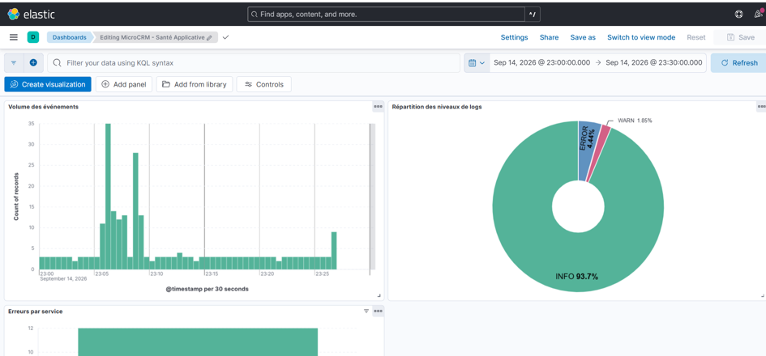

*Figure 12 — Tableau de bord complet sur la fenêtre 23:00–23:30 locale. Le panneau **Volume des événements** montre deux pics à 23:05 et 23:08 encadrant l'indisponibilité ; le donut **Répartition des niveaux** donne 93,7 % INFO, 4,4 % ERROR et 1,85 % WARN.*

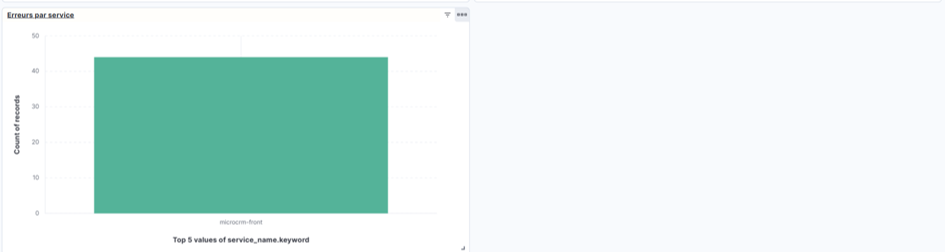

*Figure 13 — Panneau **Erreurs par service** élargi à la journée entière du 14 septembre : les **44 documents `ERROR`** de la journée sont attribués à un seul service, `microcrm-front`. La fenêtre diffère volontairement de la figure 12, afin de montrer que cette attribution unique n'est pas propre à l'incident.*

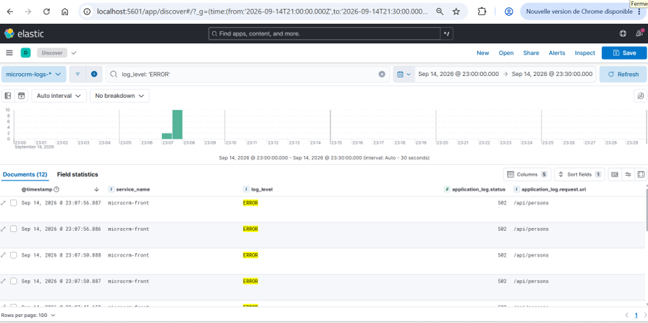

*Figure 14 — Les 12 documents `ERROR` détaillés dans **Discover**. Toutes les lignes portent `service_name: microcrm-front`, `application_log.status: 502` et `application_log.request.uri: /api/persons`, concentrées sur une seule barre à 23:07. Le code 502 identifie sans ambiguïté un échec d'`upstream` et non une erreur applicative.*

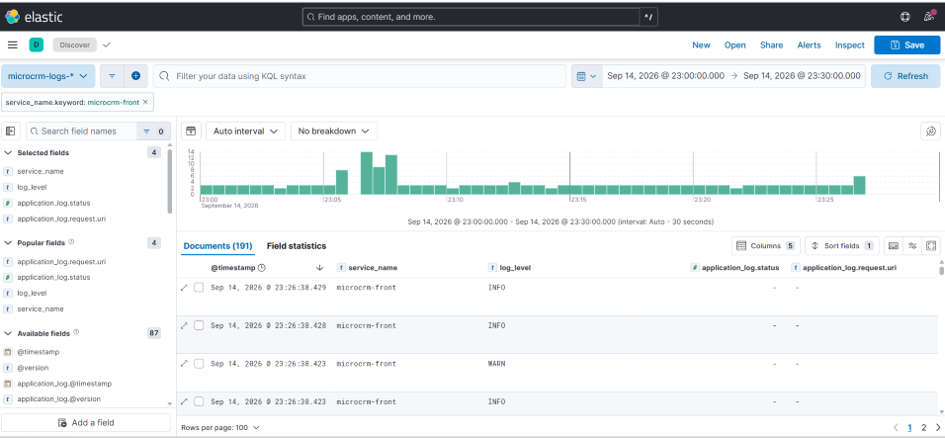

*Figure 15 — Les **191 documents** du service `microcrm-front` sur la même fenêtre, tous niveaux confondus. L'histogramme rend visible le creux d'activité pendant la panne puis la reprise, ce que le seul comptage d'erreurs ne montre pas.*

Un résultat mérite d'être souligné : **100 % des erreurs sont attribuées à `microcrm-front`, alors que c'est le backend qui est tombé**. Un service arrêté ne peut rien journaliser ; seul Caddy, qui reçoit l'échec de son `reverse_proxy`, produit un événement. La lecture du panneau `Erreurs par service` ne désigne donc pas le composant fautif mais **le premier composant capable de constater la panne**. Sans les journaux d'accès Caddy, cette indisponibilité aurait été totalement invisible.

#### Alertes

Aucune alerte automatique n'est configurée : le monitoring est destiné au poste de développement et une notification y serait sans destinataire. La surveillance repose sur un contrôle explicite pendant les 15 minutes suivant chaque déploiement, avec le filtre `log_level: "ERROR"`. Les seuils qui déclencheraient une alerte sont néanmoins définis et mesurables : taux d'erreurs supérieur à 1 % sur la fenêtre de contrôle, apparition d'un `application_log.status` supérieur ou égal à 500, ou absence totale de document récent, signe d'une rupture de la chaîne de collecte. La mise en place d'alertes Kibana est un prérequis à toute exploitation réelle.

#### Tendances observées

La chaîne fonctionne de bout en bout : quatre Quality Gates réussis, aucun échec de déploiement, des images tracées par SHA dans GHCR. Six constats se dégagent des mesures.

**1. La chaîne automatisée n'est pas le facteur limitant.** Entre un commit et une image déployable, la part incompressible est de 4 à 5 minutes, dont 2 min 14 s de CI. L'écart entre le premier Lead Time (54 min 30 s) et les suivants (13 à 17 min) vient entièrement de l'attente de revue. Optimiser la CI ne changerait presque rien ; raccourcir la prise en charge des pull requests, si.

**2. Le cache Buildx a divisé le CD par trois.** De 5 min 21 s à 1 min 42 s entre la première et la deuxième publication, soit −68 %. La première paie la construction complète, les suivantes ne rebâtissent que les couches modifiées. Cette valeur ne se compare donc pas d'un sprint à l'autre sans vérifier l'état du cache.

**3. Le taux de réussite CI de 42 % ne mesure pas la fiabilité du produit.** Les quinze échecs sont concentrés entre le 27 août et le 10 septembre, pendant la mise au point du pipeline lui-même : versions d'actions inexistantes, permissions SonarCloud, attente bloquante du Quality Gate. Aucun ne correspond à une régression applicative. Sur les quatre livraisons mesurées, le taux est de 100 %.

**4. Améliorer l'outillage peut dégrader les indicateurs.** Corriger les avertissements d'analyse a fait apparaître 226 lignes Java jusque-là absentes du périmètre, et avec elles 5 issues et 3 vulnérabilités. Une lecture naïve conclurait à une régression ; c'est en réalité la fin d'un angle mort. **Toute comparaison SonarQube entre deux livraisons doit d'abord vérifier que le périmètre est identique.**

**5. Un Quality Gate vert ne certifie pas un code sain.** Il ne porte que sur le nouveau code, or aucune des pull requests n'a introduit de ligne de production. Les 9 bugs, 4 vulnérabilités et 30 code smells du code hérité lui restent invisibles, d'où les notes C. C'est une limite structurelle, pas un défaut de configuration : seul le backlog de revue traite ce stock.

**6. La supervision détecte vite, la restauration est lente.** 5,1 secondes pour détecter, mais 97 % du MTTR consommé par le redémarrage applicatif — entre 41 et 102 secondes selon la charge machine. Le levier est le temps de démarrage du backend, pas l'outillage d'observabilité.

#### Anomalies détectées

Les anomalies suivantes proviennent des journaux, des agrégations Elasticsearch et des journaux du scanner. **Aucune n'était visible dans l'interface applicative** : toutes viennent de l'observation de la chaîne elle-même.

| # | Anomalie | Source de détection | Preuve chiffrée | Traitement |
| --- | --- | --- | --- | --- |
| A1 | Le backend comptait comme **deux services distincts** | Agrégation `terms` sur `service_name.keyword` | `microcrm-back` 56, `p7-fsja-back-1` 14, `p7-fsja-front-1` 27 | Repli sur le `tag` du driver `gelf` |
| A2 | Niveaux de log **répartis sur quatre compartiments** au lieu de deux | Même agrégation sur `log_level.keyword` | `INFO` 54, `info` 24, `WARN` 2, `warn` 3 | Normalisation en majuscules |
| A3 | **14 documents sans aucun niveau** | Écart entre total indexé et somme des compartiments | 97 indexés pour 83 ventilés | Niveau déduit de la sévérité syslog |
| A4 | **Aucun journal d'accès HTTP** côté frontend | Absence du champ `application_log.status` | 0 document avec un code HTTP avant, 33 après | Directive `log` dans le bloc de site du `Caddyfile` |
| A5 | **226 lignes Java hors du périmètre** d'analyse | Journal du scanner SonarQube | `Missing 'sonar.java.libraries'`, `java` absent de `ncloc_language_distribution` | Classpath Gradle publié comme artefact |
| A6 | **Démarrage anormalement long**, proche du seuil d'échec | Journal du conteneur backend | `Started MicroCRMApplication in 101.653 seconds` pour un budget de 140 s | Consigné en R3 ; `start_period` à 60 s |

A1, A2 et A4 partagent une propriété décisive : **aucune ne produisait d'erreur**. Un panneau « Erreurs par service » construit avant correction aurait affiché des noms de conteneurs Docker, dédoublé chaque niveau et ignoré tout code HTTP — en s'affichant parfaitement normalement, avec des chiffres faux. C'est l'argument central en faveur d'une vérification des champs indexés **avant** de construire la moindre visualisation. A5 est le même piège côté qualité : analyse réussie, Quality Gate vert, langage principal non analysé.

#### Contrôle des données personnelles

Le plan de sécurité interdit e-mails, téléphones et biographies dans les journaux. Contrôle exécuté sur l'index complet :

```shell
curl -s -XPOST "http://localhost:9200/microcrm-logs-*/_search" -H "Content-Type: application/json" \
  -d '{"size":0,"query":{"query_string":{"query":"*@*.com OR *@*.fr","fields":["message"]}}}'
```

Résultat : **0 document**. L'encodeur Logback sérialisant le contexte de journalisation, ce contrôle doit être rejoué après toute modification des messages ou ajout d'un champ au MDC. Une occurrence non nulle est un incident de sécurité.

#### Recommandations, par priorité

| Priorité | Recommandation | Justification chiffrée |
| --- | --- | --- |
| 1 | Réduire le temps de démarrage du backend et porter `start_period` à 60 s dans le healthcheck | 97 % du MTTR de 2 min 02 s ; le budget actuel du healthcheck est de 140 s pour un démarrage observé jusqu'à 102 s |
| 2 | Compléter les tests backend sur les cas d'erreur REST | Couverture backend 56,4 % contre une cible de 80 % ; seules 2 classes de test existent |
| 3 | Traiter le stock de 9 bugs et 4 vulnérabilités du code hérité | Notes de fiabilité et de sécurité à C, invisibles pour le Quality Gate |
| 4 | Compléter les tests frontend, en priorité `person-details` | Couverture 27,3 % globale, 26,7 % sur `person-details` pour 281 lignes |
| 5 | Réduire l'image backend sous 400 Mo | 558 Mo contre 70 Mo pour le frontend ; coût de transfert à chaque déploiement |
| 6 | Réduire le délai de prise en charge des pull requests | Seul poste significatif du Lead Time, 54 min 30 s contre 4 à 5 min automatisés |

#### Limites du relevé

Ces valeurs portent sur quatre déploiements répartis sur treize jours et un incident provoqué. **Elles établissent une référence, pas une tendance.** Trois conditions manquent encore : trente jours d'historique, des livraisons portant du code applicatif et non seulement de l'outillage, et au moins un incident non simulé. Le MTTR d'un incident simulé est structurellement optimiste, puisque la cause et le correctif sont connus avant même le début de la mesure.

## 7. Plan de sauvegarde des données

### 7.1 Ce qui doit être sauvegardé

| Élément | Support | Fréquence | Méthode |
| --- | --- | --- | --- |
| Code source et historique | Dépôt GitHub `zeinatofik25-svg/P7-FSJA` | À chaque push | Réplication GitHub ; chaque poste de développement détient un clone complet |
| Images applicatives | GitHub Container Registry, tag SHA immuable | À chaque déploiement | Publiées par le workflow CD, conservées sans expiration |
| Configuration d'exécution | `docker-compose.yml`, `docker-compose-elk.yml`, `misc/docker/Caddyfile`, `elk/` | À chaque push | Versionnée dans le dépôt, donc couverte par la sauvegarde du code |
| Définition du pipeline | `.github/workflows/` | À chaque push | Idem |
| Rapports de tests et de couverture | Artefacts GitHub Actions | À chaque exécution CI | Rétention par défaut de 90 jours |
| Artefacts de version | Releases GitHub (JAR et archive du build Angular) | À chaque tag `vX.Y.Z` | Attachés à la release, conservés sans expiration |
| Secrets | Secrets GitHub Actions et variables d'environnement de l'hébergeur | À chaque modification | Jamais dans le dépôt ; restauration par ressaisie manuelle |

### 7.2 Procédure de sauvegarde

#### Format, fréquence et outils

Aucun script de sauvegarde n'est à écrire : **la sauvegarde est un effet de bord du pipeline**, ce qui supprime le risque d'oubli inhérent à une procédure manuelle.

| Support | Format | Déclencheur | Outil |
| --- | --- | --- | --- |
| Dépôt GitHub | Historique Git complet | Chaque `git push` | Git, réplication GitHub |
| GHCR | Images OCI taguées par SHA | Chaque workflow CD réussi | `docker/build-push-action` |
| Artefacts d'exécution | Archives de rapports de tests et de couverture | Chaque exécution CI | `actions/upload-artifact`, rétention 90 jours |
| Releases GitHub | JAR et archive ZIP du bundle Angular | Chaque tag `vX.Y.Z` | `softprops/action-gh-release` |

La configuration d'exécution et la définition du pipeline étant versionnées, elles sont couvertes par la sauvegarde du code. Chaque poste détient par ailleurs un clone complet de l'historique : une copie hors site supplémentaire.

#### Ce qui n'est pas sauvegardé, et pourquoi

**Les données applicatives ne sont pas sauvegardées, parce qu'il n'y en a pas à conserver.** HSQLDB tourne en mémoire et recharge un jeu de fixtures à chaque démarrage : le contenu disparaît à l'arrêt du conteneur et se reconstruit à l'identique. Prétendre sauvegarder cette base serait trompeur.

Cette configuration convient à une démonstration mais **interdit toute mise en production avec conservation de données**. Une base persistante externe est le prérequis à un vrai plan de sauvegarde, qui devra alors définir fréquence, rétention, chiffrement et test de restauration périodique.

Les index Elasticsearch locaux ne sont pas sauvegardés non plus : outil de poste de développement, sans besoin de rétention. Le volume `elasticsearch-data` survit à un `docker compose down` mais disparaît avec `-v`.

### 7.3 Procédure de restauration

#### Scénario d'incident couvert

La procédure répond à trois situations : une livraison qui dégrade le service et doit être annulée, un conteneur qui ne démarre plus, ou un poste à reconstruire intégralement. Dans les trois cas, l'action est identique : **redéployer un SHA précédemment validé**. Aucune migration de données n'étant appliquée, l'opération est symétrique et ne nécessite aucune restauration de base.

#### Étapes automatisées

La restauration n'est pas une procédure à recopier : elle est automatisée par [`misc/scripts/restore.sh`](misc/scripts/restore.sh), qui prend en argument le SHA d'une version publiée.

```shell
./misc/scripts/restore.sh <sha>
```

Le script enchaîne cinq opérations et s'interrompt dès qu'une échoue : récupération des deux images depuis GHCR, réétiquetage pour Compose, redéploiement `--no-build`, attente des contrôles de santé (délai réglable par `HEALTH_TIMEOUT`), smoke test sur `/health`, `/api/persons` et `/api/organizations`.

**Le code de sortie est significatif** : `0` seulement si les deux services sont sains et si les trois appels répondent. En cas d'échec de santé, les cinquante dernières lignes de journal du service fautif s'affichent. `GHCR_OWNER` permet de rejouer depuis un miroir.

Ce même script sert au rollback : restaurer après incident et revenir à la version précédente sont la même opération.

**Mesuré le 18 septembre 2026** : restauration complète de `fa81dc4` en **37 secondes**, images en cache local, trois contrôles réussis. À comparer au MTTR de 2 min 02 s de l'incident simulé : **un rollback outillé va plus vite qu'un redémarrage attendu passivement.**

Ce test est à exécuter avant toute mise en production et après toute modification du `Dockerfile` ou de Compose. Une sauvegarde jamais restaurée n'a aucune valeur démontrée.

#### Limitations

| Limitation | Conséquence |
| --- | --- |
| Aucune donnée applicative n'est restaurée | Le contenu saisi depuis le dernier démarrage est perdu, sans exception, puisqu'il n'a jamais été persisté |
| Dépendance à GHCR | Une indisponibilité du registre empêche toute restauration, d'où la recommandation de conserver localement les images des deux derniers SHA validés |
| Restauration à l'échelle d'un hôte unique | Le script s'appuie sur Docker Compose et ne couvre pas un déploiement réparti |
| Durée conditionnée par le cache local | Les 37 secondes mesurées supposent les images déjà présentes ; un téléchargement complet du backend ajoute le transfert de 558 Mo |

## 8. Plan de mise à jour

### 8.1 Mise à jour de l'application

#### Chemin de livraison

Toute modification suit le même chemin, sans exception : branche, pull request vers `main`, CI complète, Quality Gate, publication automatique d'une image taguée par SHA, puis déploiement selon la procédure 3.3. **Aucune modification ne doit être appliquée directement sur un environnement déployé** : l'artefact deviendrait non reproductible et le rollback imprévisible.

Un correctif urgent sur une version publiée passe par une branche `hotfix/X.Y.Z` créée depuis le tag concerné, puis par une release correctrice. Le dépôt reste en trunk-based.

#### Mise à jour des dépendances applicatives

| Périmètre | Outil de détection | Commande de mise à jour | Cadence |
| --- | --- | --- | --- |
| Dépendances npm | `npm audit` dans le job `security`, alertes Dependabot | `npm update` puis `npm ci` pour régénérer `package-lock.json` | Revue à chaque sprint |
| Dépendances Gradle | `./gradlew dependencies`, scan Trivy, alertes Dependabot | Modification de `back/build.gradle` | Revue à chaque sprint |
| Images de base Docker | Scan Trivy du système de fichiers, `docker scout cves` | Modification des `FROM` du `Dockerfile` | Revue mensuelle |
| Actions GitHub | Alertes Dependabot | Mise à jour du SHA épinglé dans `.github/workflows/` | Revue mensuelle |
| Pile ELK | Notes de version Elastic | Modification des tags dans `docker-compose-elk.yml` | Revue semestrielle |

Les installations partent exclusivement des fichiers verrouillés, `npm ci` et Gradle Wrapper, afin que CI, poste de développement et image publiée résolvent les mêmes versions.

#### Règles de traitement des vulnérabilités

Une vulnérabilité **critique sur une dépendance de production** interrompt la chaîne et bloque la publication. L'audit incluant les dépendances de développement s'exécute en mode rapport : les outils de build Angular portent des vulnérabilités connues qui ne sont pas livrées en production et dont la correction impose une montée de version majeure, planifiée séparément. **Ce seuil différencié est un choix assumé, pas un contournement.**

Les mises à jour sont appliquées par lots cohérents et séparées des évolutions fonctionnelles, pour qu'une régression puisse être imputée sans ambiguïté. Une montée majeure de Java, Node.js, Spring Boot ou Angular fait l'objet d'une pull request dédiée.

### 8.2 Mise à jour du pipeline CI/CD

| Élément | Localisation | Mode de mise à jour | Contrôle après modification |
| --- | --- | --- | --- |
| Actions GitHub | `.github/workflows/*.yml` | Remplacer le SHA épinglé par celui de la nouvelle version, après lecture des notes de version | Exécution complète de la CI sur une branche dédiée |
| Versions d'outils | `setup-java`, `setup-node` dans `ci.yml` | Aligner sur les versions supportées par le code applicatif | Vérifier que le build et les tests passent avec la nouvelle version |
| Tâches Gradle du pipeline | [back/build.gradle](back/build.gradle) | Modifier `collectSonarLibraries` ou `jacocoTestReport` | Valider localement avant de pousser, un échec de CI dégradant le KPI de taux de réussite |
| Propriétés du scanner SonarQube | Bloc `args` du job `sonar` | Ajouter ou corriger une propriété | Vérifier que l'analyse ne produit **aucun avertissement** |
| Script de restauration | [misc/scripts/restore.sh](misc/scripts/restore.sh) | Modifier puis contrôler la syntaxe par `bash -n` | Exécuter le script sur un SHA connu et vérifier le code de sortie |
| Pile de monitoring | [docker-compose-elk.yml](docker-compose-elk.yml) | Modifier les tags Elastic des trois services simultanément | Contrôler l'indexation par `_count` après redémarrage |

Toute modification du pipeline est testée sur une branche avant d'atteindre `main` : la CI s'exécute sur chaque push, y compris sur une branche de travail. Une modification des propriétés du scanner doit être vérifiée dans les journaux du job `sonar`, où **un avertissement révèle un périmètre incomplet sans jamais faire échouer l'exécution**.

### 8.3 Fréquence et bonnes pratiques

#### Vérification après mise à jour

Une mise à jour n'est réussie qu'après trois contrôles : CI verte, Quality Gate réussi, et absence de hausse du taux d'erreurs dans Kibana pendant les 15 minutes suivant le déploiement. Les métriques DORA relevées à chaque livraison révèlent une dégradation progressive de la chaîne : allongement du Lead Time, hausse du Change Failure Rate.

#### Ajustement périodique des processus

Les seuils et procédures de ce document décrivent l'état du projet à sa date de rédaction. **Ils sont datés par construction.** Les conserver sans révision reproduirait le défaut déjà constaté sur le plan de testing, qui annonçait un contrôle hebdomadaire inexistant : une documentation rassurante et fausse.

La revue est déclenchée par un événement, pas par le calendrier :

| Déclencheur | Conséquence |
| --- | --- |
| Montée majeure de Java, Node.js, Spring Boot ou Angular | Revalider les temps de démarrage et de build, donc les seuils du healthcheck et des KPI de durée |
| Ajout d'une base persistante | Rend caduc le plan de sauvegarde : fréquence, rétention, chiffrement et restauration des données à définir ; lève R1 |
| Changement d'hébergement ou d'orchestrateur | Réécrire le plan de déploiement et le script de restauration, qui supposent Compose sur un hôte unique |
| Dérive d'une métrique sur deux relevés consécutifs | Analyser la cause **avant** de toucher au seuil : un seuil ajusté pour absorber une dérive masque le problème qu'il devait signaler |

Trois ajustements sont déjà identifiés :

- **Resserrer le seuil de durée CI.** Une cible de 15 minutes face à 2 min 14 s mesurées ne déclencherait jamais d'alerte, même si la CI triplait.
- **Recalculer le taux de réussite CI sur une fenêtre glissante.** Les 42 % historiques agrègent la mise au point du pipeline et n'ont aucune signification opérationnelle.
- **Resserrer le seuil d'audit des dépendances de développement**, une fois Angular monté en version majeure.

Le principe directeur : **un indicateur qui ne déclenche jamais d'action doit être supprimé ou son seuil resserré.** Un tableau de bord dont tous les voyants sont verts en permanence ne surveille rien.

## 9. Conclusion

### 9.1 Résumé des améliorations apportées

Le projet est passé d'un dépôt sans automatisation à une chaîne complète, mesurée et documentée.

| Domaine | Avant | Après |
| --- | --- | --- |
| Intégration | Aucun workflow | 4 jobs, déclenchés sur push, pull request, nuit et manuellement |
| Publication | Aucune | Images GHCR taguées par SHA immuable, publiées uniquement après CI verte |
| Versionnement | Aucun | Releases SemVer avec vérification du démarrage réel du JAR |
| Qualité | Aucune analyse | SonarQube Cloud, Quality Gate bloquant, **0 avertissement d'analyse** |
| Couverture | Non mesurée | 37,6 % global, dont 56,4 % backend via JaCoCo |
| Périmètre analysé | **Java totalement absent** | 226 lignes Java analysées, 5 issues révélées |
| Sécurité | Aucun contrôle | `npm audit`, Trivy secrets bloquant, actions épinglées par SHA |
| Observabilité | Sortie standard uniquement | Pile ELK, journaux JSON normalisés, tableau de bord à 3 panneaux |
| Restauration | Aucune procédure | Script automatisé, testé, **37 secondes mesurées** |
| Pilotage | Aucune métrique | 4 métriques DORA et 8 KPI relevés sur 4 déploiements réels |

### 9.2 Gains observés

**Fiabilité.** Quatre déploiements, quatre Quality Gates réussis, aucun échec de publication, aucune régression : Change Failure Rate à 0 %. La correction du classpath a supprimé un angle mort qui rendait le contrôle qualité inopérant sur le langage principal du backend.

**Rapidité.** 4 à 5 minutes entre un commit et une image déployable, dont 2 min 14 s de CI. Le cache Buildx a réduit la publication de 68 % dès la deuxième livraison.

**Qualité.** Le passage de 18,8 % à 37,6 % de couverture ne vient pas de tests ajoutés, mais de la correction de la chaîne de mesure. D'où une règle utile : **avant d'améliorer un indicateur, vérifier qu'il mesure ce qu'il prétend mesurer.**

**Réaction.** Incident détecté en 5,1 secondes, service rétabli en 2 min 02 s. Le script de restauration fait mieux, 37 secondes, **parce qu'il agit au lieu d'attendre**.

### 9.3 Recommandations pour les itérations suivantes

Détaillées et chiffrées en 6.3. Par ordre de priorité :

1. **Réduire le temps de démarrage du backend** et porter `start_period` à 60 s : 97 % du MTTR, et une menace directe sur les déploiements en machine lente.
2. **Compléter les tests backend sur les cas d'erreur REST** : 56,4 % de couverture, deux classes de test, aucun scénario d'erreur.
3. **Traiter les 9 bugs et 4 vulnérabilités** du code hérité, invisibles pour un Quality Gate qui ne voit que le nouveau code.
4. **Migrer vers une base persistante externe**, prérequis absolu à toute exploitation avec des données réelles.
5. **Ajouter un smoke test automatisé après publication**, pour qu'une image incapable de démarrer ne puisse jamais être promue.

Ces valeurs portent sur treize jours d'observation. Elles constituent une **référence initiale, pas une tendance** : trente jours d'historique, des livraisons portant du code applicatif et au moins un incident non simulé restent nécessaires avant d'en tirer des conclusions de performance.

## Annexes

### A. Lancer le projet depuis les sources

**Prérequis** : OpenJDK ≥ 17, npm ≥ 10.2.4, et Google Chrome ou Chromium pour les tests frontend.

```shell
# Backend : construire puis démarrer, API sur http://localhost:8080
cd back
./gradlew build                 # gradlew.bat build sous Windows
java -jar build/libs/microcrm-0.0.1-SNAPSHOT.jar

# Frontend : serveur de développement sur http://localhost:4200
cd front
npm install
npx @angular/cli serve
```

### B. Exécuter les tests en local

```shell
cd back
./gradlew test

cd front
CHROME_BIN=</chemin/vers/chrome> npm test
```

### C. Construire les images Docker en local

```shell
# Frontend, disponible sur http://localhost
docker build --target front -t orion-microcrm-front:latest .
docker run -it --rm -p 80:80 orion-microcrm-front:latest

# Backend, API sur http://localhost:8080
docker build --target back -t orion-microcrm-back:latest .
docker run -it --rm -p 8080:8080 orion-microcrm-back:latest

# Tout-en-un, démonstration uniquement, jamais en production
docker build --target standalone -t orion-microcrm-standalone:latest .
docker run -it --rm -p 8080:8080 -p 80:80 orion-microcrm-standalone:latest
```

### D. Commandes de relevé des métriques

```shell
# Durée totale d'une exécution de workflow, en millisecondes
gh api repos/<owner>/<repo>/actions/runs/<runId>/timing

# Durée de chaque job d'une exécution
gh api repos/<owner>/<repo>/actions/runs/<runId>/jobs

# Date d'auteur d'un commit, point de départ du Lead Time
git log -1 --format=%aI <sha>

# Quality Gate et mesures SonarQube sur la branche principale
curl "https://sonarcloud.io/api/qualitygates/project_status?projectKey=<key>&branch=main"
curl "https://sonarcloud.io/api/measures/component?component=<key>&branch=main&metricKeys=coverage,bugs,vulnerabilities,code_smells,ncloc"

# Volume total de journaux indexés
curl "http://localhost:9200/microcrm-logs-*/_count"

# Répartition par service et par niveau sur une fenêtre donnée
curl -XPOST "http://localhost:9200/microcrm-logs-*/_search" -H "Content-Type: application/json" -d '{
  "size": 0,
  "query": { "range": { "@timestamp": { "gte": "now-15m" } } },
  "aggs": {
    "svc": { "terms": { "field": "service_name.keyword" } },
    "lvl": { "terms": { "field": "log_level.keyword" } }
  }
}'
```

Pour ouvrir Kibana directement sur une fenêtre précise sans se soucier du fuseau horaire, le suffixe `Z` force l'UTC :

```
http://localhost:5601/app/discover#/?_g=(time:(from:'2026-09-14T21:00:00.000Z',to:'2026-09-14T21:30:00.000Z'))
```

### E. Index des figures

| Figure | Section | Contenu | Preuve apportée |
| --- | --- | --- | --- |
| 1 | 2.1 | Exécution CI, 4 jobs | Parallélisation des jobs, durée 2 min 07 s |
| 2 | 2.1 | Exécution CD n° 1 | Publication déclenchée par `workflow_run`, 5 min 21 s |
| 3 | 2.1 | Panneau Packages GHCR | Les deux images sont publiées et tagguées |
| 4 | 2.2 | Avertissements d'analyse SonarCloud | Les 3 avertissements, avec un Quality Gate pourtant `Passed` |
| 5 | 2.2 | Couverture avant JaCoCo | `back/src` à 0,0 % |
| 6 | 2.2 | Couverture après JaCoCo | `back/src` à 56,4 % sans test ajouté |
| 7 | 5.1 | Vue d'ensemble SonarCloud | Quality Gate `Passed`, notes C / C / A |
| 8 | 5.1 | Couverture par répertoire | Écart de 29 points entre backend et frontend |
| 9 | 5.1 | Issues Java | Alertes CORS confirmant le risque R2 |
| 10 | 6.1 | Historique du CD | Effet du cache Buildx, 5 min 21 s puis 1 min 42 s |
| 11 | 6.1 | Troisième déploiement | 2 min 21 s |
| 12 | 6.3 | Tableau de bord Kibana | Volume, niveaux et erreurs sur la fenêtre de l'incident |
| 13 | 6.3 | Erreurs par service sur la journée | 44 erreurs, un seul service concerné |
| 14 | 6.3 | Discover filtré sur `ERROR` | 12 documents, statut 502 sur `/api/persons` |
| 15 | 6.3 | Histogramme du frontend | 191 documents, creux d'activité pendant la panne |

